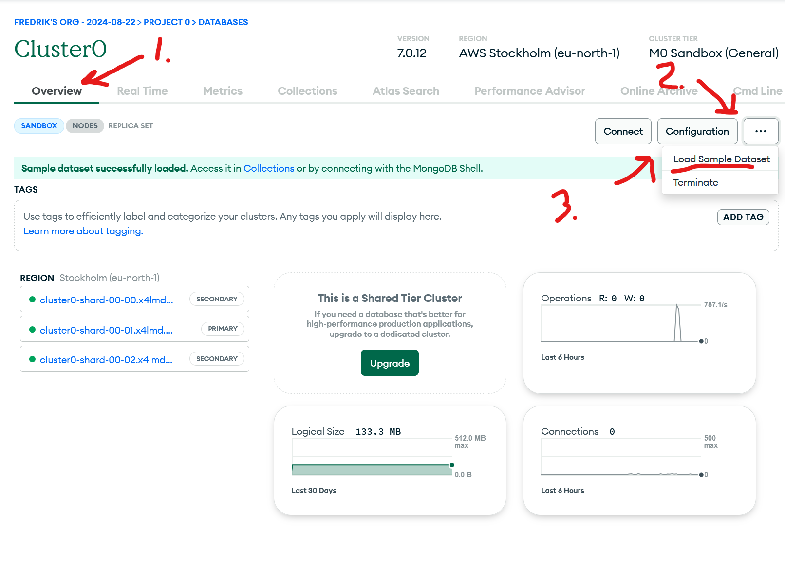

# **GraphQL**

## Idag

- GraphQL med MongoDb och mongoose
- Första examinationsuppgift (grupp-uppgift) skickas ut senare idag
  - Redovisning och inlämning sista veckan 

---

## Flexibla queries

- **REST**: Med REST definierar du vanligtvis flera endpoints för olika resurser och åtgärder, såsom `/books`, `/books/:id`, `/authors`, etc. Varje endpoint returnerar en fördefinierad datastruktur.
- **GraphQL**: En enda GraphQL-endpoint tillåter klienter att begära exakt den data de behöver. Till exempel kan en klient begära endast `title` och `author` för en bok utan att hämta onödig data (overfetching/underfetching).

---

## En enda endpoint

- **REST**: Flera endpoints krävs för att hantera olika typer av dataförfrågningar (t.ex. GET, POST, PUT, DELETE). Att hantera och underhålla dessa endpoints kan bli komplext när din applikation växer.
- **GraphQL**: Alla operationer (frågor, mutationer, prenumerationer) utförs via en enda endpoint, vanligtvis `/graphql`. Detta kan förenkla API.

---

## Enklare versionshantering av API

- **REST**: När du behöver ändra strukturen på ett objekt (t.ex. lägga till ett nytt fält) måste du ofta versionera ditt API för att undvika "breaking changes", vilket leder till komplexiteten att underhålla flera versioner av APIet.
- **GraphQL**: Du kan lägga till nya fält i GraphQL-schemat utan att påverka befintliga queries. Klienter kommer endast att ta emot den data de uttryckligen frågar efter, vilket gör det lättare att utveckla API:et utan att introducera "breaking changes".

---

## Verktyg

- **REST**: Kan använda verktyg som OpenAPI (Swagger) för att definiera din API-struktur och dokumentation.
- **GraphQL**: Inbyggda verktyg som GraphiQL och GraphQL Playground ger ett interaktivt gränssnitt för att utforska schema och dokumentation av APIet.

---

## Real-tidskapacitet

- **REST**: Använder vanligtvis tekniker som polling eller long-polling för att tillhandahålla realtidsuppdateringar, vilket kan vara ineffektivt.
- **GraphQL**: Stödjer prenumerationer, vilket möjliggör realtidsuppdateringar direkt från servern via WebSockets, vilket kan vara mer effektivt och responsivt.

---

## Sammanfattning

- **Använd GraphQL** när du behöver flexibilitet i queries, särskilt för klienttunga applikationer
  
- **Använd REST** när ditt API är enkelt och du behöver dra nytta av befintlig HTTP-infrastruktur (som caching eller övervakning)

Varje lösning har sin plats, och valet beror på de specifika behoven i din applikation och ditt utvecklingsteam.

---

## Länkar

- [GraphQL](https://graphql.org/learn/)
- [Sammanfattning av GraphQL på YouTube](https://www.youtube.com/watch?v=eIQh02xuVw4)

---

## Uppgift - GraphQL with MongoDb

[Länk till repo och instruktioner](https://github.com/flindr2/graphql-mongodb/tree/main)

---

## Uppgift - sample_flix

- Skapa ett GraphQL-schema för collection `movies` i databasen `sample_mflix`
  - Den skapas automatiskt i ditt MongoDb kluster, men finns den inte så kan den skapas under din kluster-Overview => Klicka på "..." till höger om Configuration => "Load Sample Dataset".
  - Tips: låt ChatGPT eller Copilot skapa schema utifrån ett `movie`-dokument som du kan se i MongoDb Atlas
- Lägg till möjlighet att ange hur många filmer som önskas i din query
- Lägg till möjlighet att sortera filmerna på olika sätt (t.ex. år, betyg)
- Lägg till möjlighet att filtrera filmerna på olika sätt (t.ex. år, genre)
- Skapa en frontend och hämta data med [Apollo Client](https://www.apollographql.com/docs/react/get-started).
- Skapa en sida där användaren själv kan sortera, filtrera de olika filmerna.

---

## Extrauppgift - Shipwrecks

- Importera testdatabaserna (se längst ner i detta dokument)
- Använd databasen `sample_geospatial` och skapa GraphQL-schema för collection `shipwrecks`
- Frontend: använd valfritt kartbibliotek (t.ex Google Maps eller LeafletJS) för att på kartan plotta båtar som förlist med koordinaterna latdec/londec

---

## Extrauppgift - Väderdata

- Importera testdatabaserna (se längst ner i detta dokument)
- Använd databasen `sample_weatherdata` och skapa GraphQL-schema för collection `data`
- Frontend: Använd valfritt graf-bibliotek för att plotta grafer med väderdata du tycker vore intressant.

---

## Importera Sample Dataset

- För att importera testdatabaser.
- 
